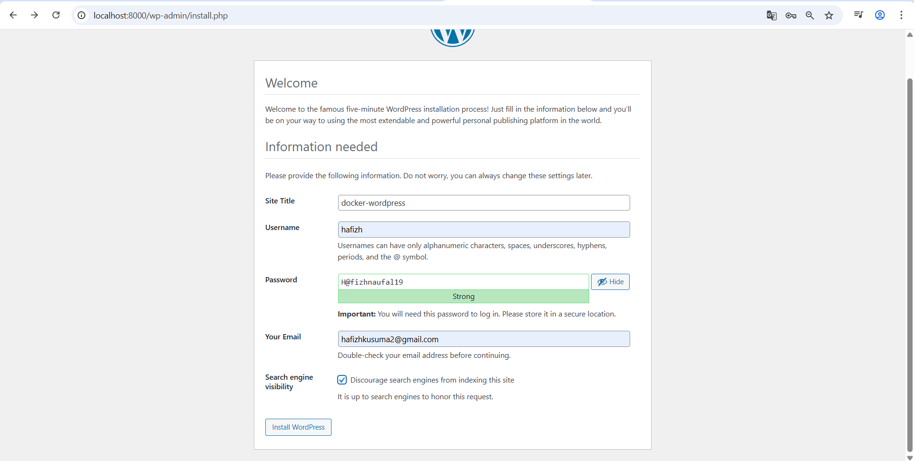
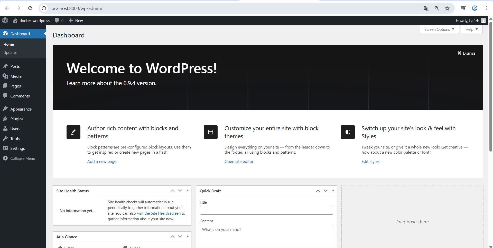
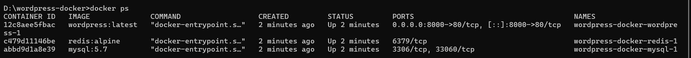
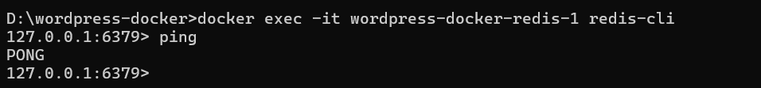
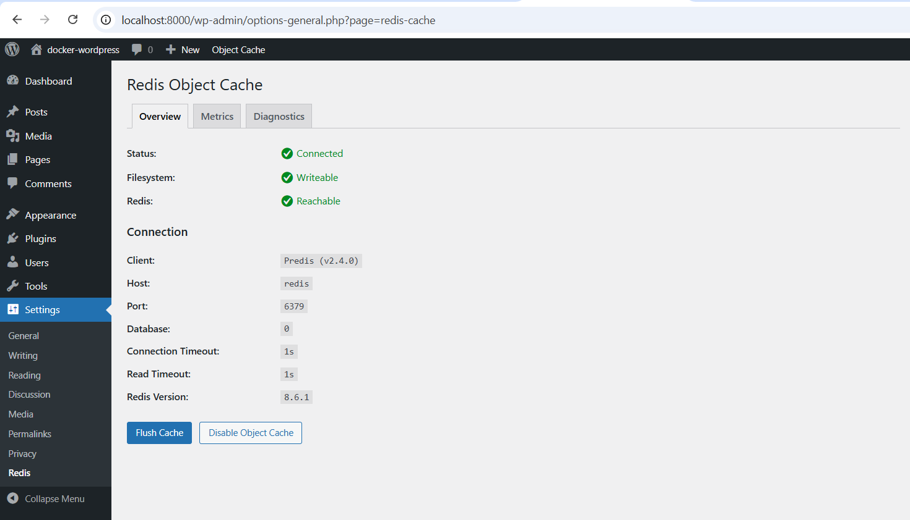

# WordPress dengan MySQL dan Redis menggunakan Docker Compose

## Deskripsi Project

Project ini bertujuan untuk melakukan deployment WordPress menggunakan Docker Compose dengan arsitektur multi-container. WordPress digunakan sebagai aplikasi utama, MySQL sebagai database, dan Redis sebagai object cache untuk meningkatkan performa.

Melalui project ini, dipelajari konsep dasar container orchestration, komunikasi antar container, penggunaan volume untuk penyimpanan data, serta optimasi aplikasi menggunakan caching.

---

## Arsitektur Sistem

Project ini terdiri dari tiga service utama:

* WordPress sebagai aplikasi web
* MySQL sebagai database
* Redis sebagai object cache

Ketiga service berjalan dalam satu network Docker sehingga dapat saling berkomunikasi menggunakan nama service.

---

## Struktur Folder

```
wordpress-docker/
├── docker-compose.yml
├── README.md
└── screenshots/
    ├── install.png
    ├── dashboard.png
    ├── docker-ps.png
    ├── redis-ping.png
    ├── redis-connected.png
    └── plugin-redis.png
```

---

## Langkah Menjalankan Project

### 1. Masuk ke direktori project

```
cd wordpress-docker
```

### 2. Jalankan Docker Compose

```
docker compose up -d
```

Perintah ini akan menjalankan seluruh service (WordPress, MySQL, Redis) secara otomatis.

---

### 3. Cek container yang berjalan

```
docker ps
```

Pastikan terdapat tiga container aktif:

* wordpress
* mysql
* redis

---

### 4. Akses WordPress

Buka browser dan akses:

```
http://localhost:8000
```

Lakukan proses instalasi WordPress hingga selesai.

---

## Screenshot Dokumentasi

### 1. Halaman Instalasi WordPress

File:




Menampilkan halaman awal instalasi WordPress saat pertama kali diakses.

---

### 2. Dashboard WordPress

File:



Menampilkan halaman admin WordPress setelah login berhasil.

---

### 3. Container Berjalan

File:



Perintah yang digunakan:

```
docker ps
```

Menunjukkan bahwa ketiga container berjalan dengan baik.

---

### 4. Redis CLI Test

File:



Perintah:

```
docker exec -it wordpress-docker-redis-1 redis-cli ping
```

Output yang diharapkan:

```
PONG
```

---

### 5. Plugin Redis di WordPress

File:



Menampilkan plugin Redis Object Cache dalam keadaan aktif.

---

### 6. Status Redis di WordPress

File:

```
screenshots/redis-connected.png
```

Menampilkan status Redis Connected dan Reachable pada menu Settings → Redis.

---

## Konfigurasi Docker Compose

Berikut konfigurasi yang digunakan pada file `docker-compose.yml`:

```yaml
version: '3.8'

services:
  wordpress:
    image: wordpress:latest
    ports:
      - "8000:80"
    environment:
      WORDPRESS_DB_HOST: mysql:3306
      WORDPRESS_DB_NAME: wordpress_db
      WORDPRESS_DB_USER: wordpress_user
      WORDPRESS_DB_PASSWORD: wordpress_pass
    depends_on:
      - mysql
      - redis
    volumes:
      - wordpress_data:/var/www/html

  mysql:
    image: mysql:5.7
    environment:
      MYSQL_ROOT_PASSWORD: rootpass
      MYSQL_DATABASE: wordpress_db
      MYSQL_USER: wordpress_user
      MYSQL_PASSWORD: wordpress_pass
    volumes:
      - mysql_data:/var/lib/mysql

  redis:
    image: redis:alpine

volumes:
  wordpress_data:
  mysql_data:
```

Konfigurasi ini memungkinkan ketiga service berjalan secara terintegrasi dalam satu environment.

---

## Konfigurasi Redis pada WordPress

Redis diaktifkan melalui file `wp-config.php` dengan konfigurasi berikut:

```php
define('WP_REDIS_HOST', 'redis');
define('WP_REDIS_PORT', 6379);
define('WP_REDIS_CLIENT', 'predis');
```

Konfigurasi ini memungkinkan WordPress terhubung ke Redis container melalui Docker network.

---

## Data Persistence

Data disimpan menggunakan Docker volume agar tidak hilang saat container dihentikan atau dijalankan ulang.

Volume yang digunakan:

* WordPress: `/var/www/html`
* MySQL: `/var/lib/mysql`

### Pengujian

```
docker compose down
docker compose up -d
```

Setelah dijalankan ulang, data tetap tersedia, yang menunjukkan bahwa volume bekerja dengan baik.

---

## Pengujian Sistem

Beberapa pengujian yang dilakukan:

* WordPress dapat diakses melalui browser
* Database MySQL dapat digunakan untuk membuat post
* Redis berhasil terhubung dan aktif
* Container berjalan secara bersamaan
* Data tetap tersimpan setelah restart

---

## Jawaban Pertanyaan

### 1. Kenapa perlu volume untuk MySQL?

Volume digunakan agar data database tetap tersimpan walaupun container dihentikan atau dihapus. Tanpa volume, data akan hilang setiap kali container dimatikan.

---

### 2. Apa fungsi depends_on?

`depends_on` digunakan untuk mengatur urutan startup container, sehingga WordPress akan dijalankan setelah MySQL dan Redis aktif.

---

### 3. Bagaimana cara WordPress terhubung ke MySQL?

WordPress terhubung ke MySQL melalui environment variables pada Docker Compose. Komunikasi dilakukan menggunakan nama service `mysql` melalui Docker network.

---

### 4. Apa keuntungan menggunakan Redis pada WordPress?

Redis digunakan untuk caching sehingga dapat:

* mengurangi beban query database
* mempercepat respon website
* meningkatkan performa aplikasi

---

## Kesimpulan

Project ini berhasil mengimplementasikan WordPress dengan arsitektur multi-container menggunakan Docker Compose. Integrasi MySQL sebagai database dan Redis sebagai cache berjalan dengan baik. Seluruh layanan saling terhubung dan dapat berjalan secara stabil dengan dukungan data persistence.

---
